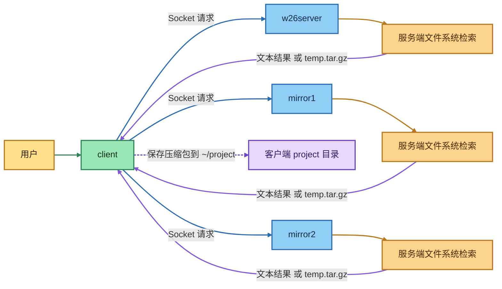

# ASP_Group Project README

## 1. 项目简介
本项目是一个基于 Socket 的客户端-服务端文件检索系统，包含 1 个主服务端和 2 个镜像服务端：

- w26server（主服务）
- mirror1（镜像服务 1）
- mirror2（镜像服务 2）
- client（客户端）

当前代码已实现 P0/P1/P2 的核心命令链路，包括文本响应与压缩包二进制回传。

## 2. 项目结构图
```text
ASP_Group/
├── src/
│   ├── w26server.c
│   ├── mirror1.c
│   ├── mirror2.c
│   └── client.c
├── scripts/
│   ├── run_w26server.sh
│   ├── run_mirror1.sh
│   ├── run_mirror2.sh
│   ├── run_client.sh
│   ├── start_all_servers.sh
│   ├── stop_all_servers.sh
│   └── server_status.sh
├── Makefile
├── .gitignore
├── doc/
│   ├── Project_W26.pdf
│   ├── Requirement_Summary.md
│   └── Requirement_Summary_zh.md
├── logs/                # 运行时生成（服务端日志）
├── .pids/               # 运行时生成（服务端进程号）
└── out/
    ├── w26server
    ├── mirror1
    ├── mirror2
    └── client
```

## 3. 架构图


## 4. 编译脚本
当前 Makefile 会将编译产物统一输出到 out 目录。

```bash
#!/usr/bin/env bash
set -e

cd "$(cd "$(dirname "$0")" && pwd)"
make clean
make
```

等效命令：

```bash
make clean && make
```

## 5. 运行脚本
已提供两种运行方式：逐个启动和一键启动。

### 5.1 方式一：逐个启动（4 个终端）
终端 1（主服务端）：

```bash
./scripts/run_w26server.sh
```

终端 2（镜像服务端 1）：

```bash
./scripts/run_mirror1.sh
```

终端 3（镜像服务端 2）：

```bash
./scripts/run_mirror2.sh
```

终端 4（客户端）：

```bash
./scripts/run_client.sh
```

### 5.2 方式二：一键管理服务端
一键后台启动 3 个服务端（自动创建 logs 和 .pids）：

```bash
./scripts/start_all_servers.sh
```

按参数控制扫描根目录和递归深度：

```bash
./scripts/start_all_servers.sh --root /path/to/search --depth 6
```

查看服务端状态：

```bash
./scripts/server_status.sh
```

停止全部服务端：

```bash
./scripts/stop_all_servers.sh
```

启动完成后，再单独启动客户端：

```bash
./scripts/run_client.sh
```

### 5.3 脚本列表说明
- `scripts/run_w26server.sh`：前台启动主服务端。
- `scripts/run_mirror1.sh`：前台启动镜像服务端 1。
- `scripts/run_mirror2.sh`：前台启动镜像服务端 2。
- `scripts/run_client.sh`：前台启动客户端。
- `scripts/start_all_servers.sh`：后台一键启动 3 个服务端，并记录 PID 与日志。
    - 可选参数：`--root <path>`、`--depth <1-64>`。
- `scripts/server_status.sh`：检查 3 个服务端的 PID 与运行状态。
- `scripts/stop_all_servers.sh`：根据 PID 文件停止全部服务端。

## 6. 常用测试命令示例
客户端启动后可输入：

```text
dirlist -a
dirlist -t
fn sample.txt
fz 100 10000
ft c txt
fdb 2026-01-01
fda 2026-03-31
quitc
```

## 7. 说明
- out 目录用于存放编译产物。
- .gitignore 已配置忽略 out 目录。
- logs 目录由 `start_all_servers.sh` 自动生成，用于保存服务端日志。
- .pids 目录由 `start_all_servers.sh` 自动生成，用于保存服务端 PID 文件。
- 当前已支持命令：`dirlist -a`、`dirlist -t`、`fn <filename>`、`fz <size1> <size2>`、`ft <ext1> [ext2] [ext3]`、`fdb <YYYY-MM-DD>`、`fda <YYYY-MM-DD>`、`quitc`。
- 当 `fz/ft/fdb/fda` 匹配到文件时，服务端按 `FILE <size>\n + 二进制数据` 协议发送压缩包，客户端保存到 `~/project/temp.tar.gz`。
- 支持环境变量控制扫描范围与开销：
    - `W26_SEARCH_ROOT`：覆盖默认搜索根目录（默认 `HOME`）。
    - `W26_MAX_SCAN_DEPTH`：限制递归深度，默认 `8`，取值范围 `1-64`。
- 在大目录执行 `fda/fdb` 时，建议设置较小 `W26_SEARCH_ROOT` 和 `W26_MAX_SCAN_DEPTH` 以避免耗时过长。

## 8. 状态发现协议
当前实现采用“镜像主动心跳 + 主服务端在线表 + 客户端按可用性选路”。

### 8.1 协议命令
- `HEARTBEAT mirror1`：由 mirror1 周期上报给 w26server。
- `HEARTBEAT mirror2`：由 mirror2 周期上报给 w26server。
- `GET_NODES`：客户端向 w26server 请求在线表。
- `PING`：基础连通性检测命令。

### 8.2 在线判定规则
- w26server 维护镜像最近心跳时间（状态文件：`/tmp/w26_nodes_status.txt`）。
- 当 `当前时间 - 最近心跳时间 <= TTL` 时，节点视为在线。
- 当前 TTL 为 6 秒，镜像心跳周期为 2 秒。

### 8.3 客户端选路策略
- 连接序号优先级：
    - 1-2 -> w26server
    - 3-4 -> mirror1
    - 5-6 -> mirror2
    - 7+ 按 `w26server -> mirror1 -> mirror2` 循环
- 在优先节点不可用时，客户端按顺序跳过到下一个在线节点。
- 客户端对 `GET_NODES` 结果做短缓存（TTL 2 秒），降低每条命令都查询在线表的开销。