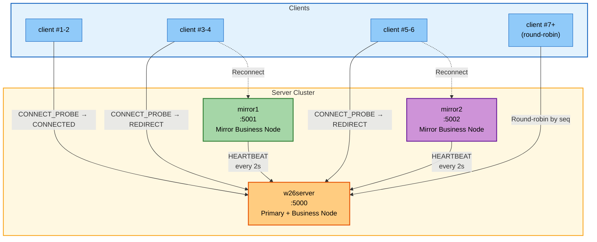
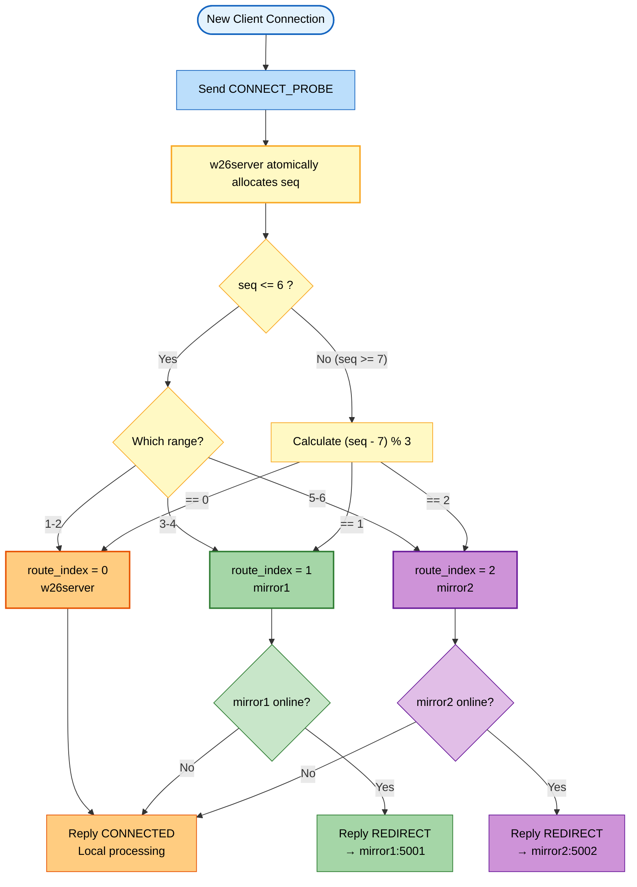
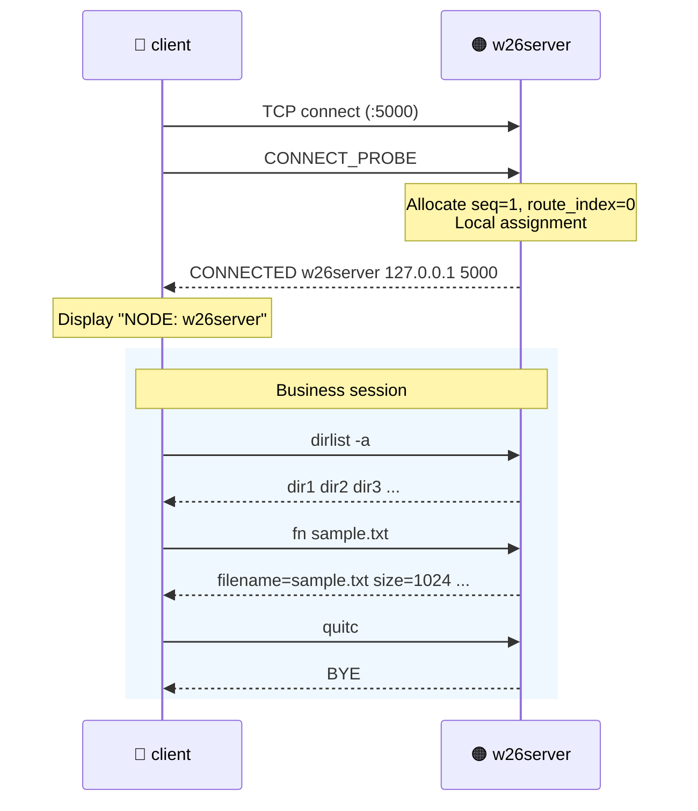
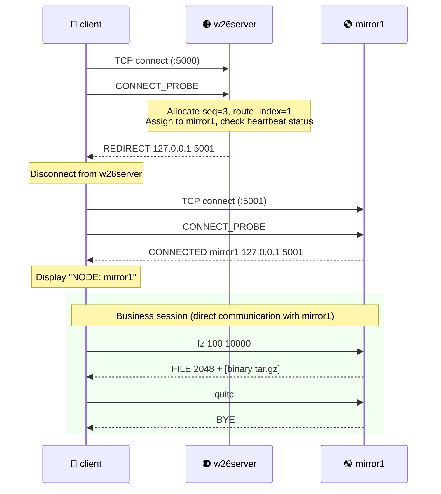
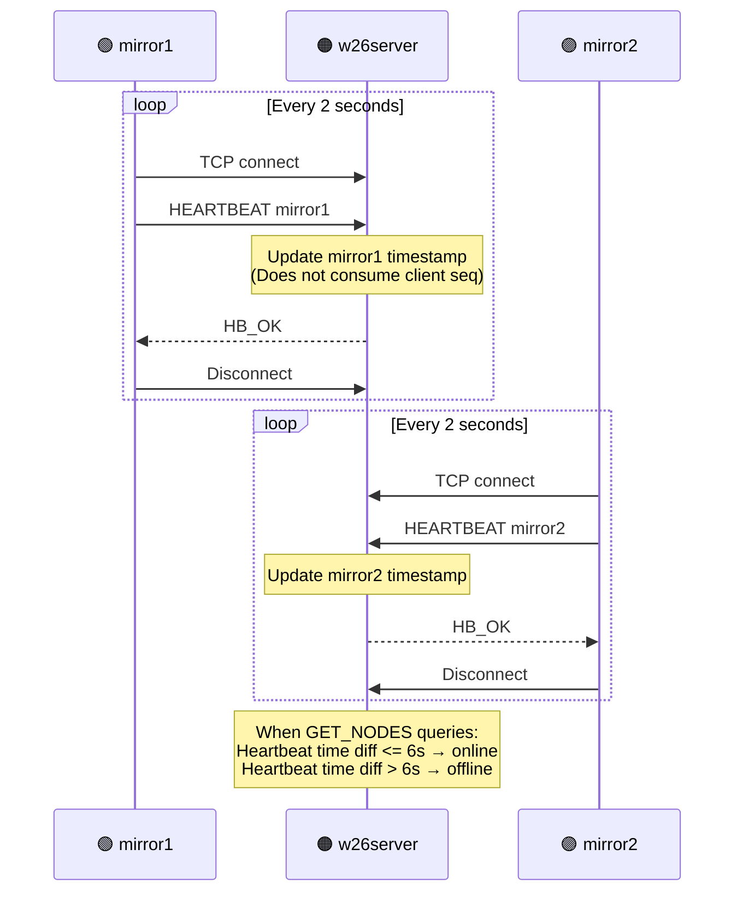
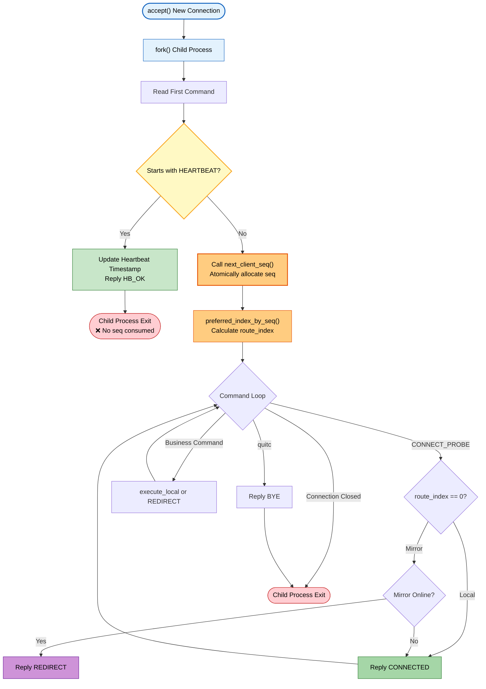

# ASP_Group — Distributed File Retrieval System

## 1. Project Overview

A Socket-based distributed file retrieval system featuring a **1 Primary + 2 Mirror** three-node architecture:

| Component   | Port | Responsibility                                                        |
| ----------- | ---- | --------------------------------------------------------------------- |
| `w26server` | 5000 | Primary server: connection gateway, global sequence allocation, node operations |
| `mirror1`   | 5001 | Mirror node 1: independent business processing, reports online status via heartbeat |
| `mirror2`   | 5002 | Mirror node 2: same as mirror1                                        |
| `client`    | —    | Client: connects to primary, follows REDIRECT to target node           |

All three service nodes have **complete and equivalent business processing capabilities** (dirlist / fn / fz / ft / fdb / fda) and do not rely on primary server proxy forwarding.

## 2. System Architecture



## 3. Client Sequence Number Allocation Rules

Client connection sequence numbers are allocated by `w26server` through an atomic file counter (`/tmp/w26_client_seq.txt`). **Heartbeat connections do not consume sequence numbers**.

| Sequence Number    | Assigned Node | Description                      |
| ------------------ | ------------- | -------------------------------- |
| 1-2                | w26server    | Primary server local processing  |
| 3-4                | mirror1      | Redirect to mirror1              |
| 5-6                | mirror2      | Redirect to mirror2              |
| 7, 10, 13, 16...   | w26server    | Round-robin (seq-7) % 3 == 0    |
| 8, 11, 14, 17...   | mirror1      | Round-robin (seq-7) % 3 == 1    |
| 9, 12, 15, 18...   | mirror2      | Round-robin (seq-7) % 3 == 2    |

Sequence numbers reset when `w26server` starts and only increment during runtime.



## 4. Client Connection Sequence

### 4.1 Assigned to w26server (Local Processing)



### 4.2 Assigned to Mirror (REDIRECT Reconnection)



### 4.3 Heartbeat Reporting



### 4.4 Client-Server Full Interaction Sequence

```mermaid
%%{init: {
    "theme": "base",
    "themeVariables": {
        "primaryColor": "#fff",
        "lineColor": "#666",
        "tertiaryColor": "#fff"
    },
    "themeCSS": "
        .messageLine0,.messageLine1,.messageLine2,.messageLine3,.messageLine4,.messageLine5,.messageLine6,.messageLine7{stroke:#1565c0!important;}
        .messageLine8,.messageLine9,.messageLine10,.messageLine11,.messageLine12,.messageLine13,.messageLine14,.messageLine15{stroke:#2e7d32!important;}
        .messageLine16,.messageLine17,.messageLine18,.messageLine19,.messageLine20,.messageLine21,.messageLine22,.messageLine23{stroke:#6a1b9a!important;}
        .messageLine24,.messageLine25,.messageLine26,.messageLine27,.messageLine28,.messageLine29,.messageLine30,.messageLine31{stroke:#ef6c00!important;}
        .messageLine32,.messageLine33,.messageLine34,.messageLine35,.messageLine36,.messageLine37,.messageLine38,.messageLine39{stroke:#00838f!important;}
        .messageLine40,.messageLine41,.messageLine42,.messageLine43,.messageLine44,.messageLine45,.messageLine46,.messageLine47{stroke:#c62828!important;}
    "
}}%%
sequenceDiagram
    autonumber

    box rgb(208, 235, 255) Client Side
        participant C as Client
    end

    box rgb(255, 224, 178) Primary Server Side
        participant W as w26server:5000
        participant SF as /tmp/w26_client_seq.txt
        participant ST as /tmp/w26_nodes_status.txt
    end

    box rgb(200, 230, 201) Mirror Server Side
        participant M1 as mirror1:5001
        participant M2 as mirror2:5002
    end

    %% ===== Connection and Routing Probe =====
    rect rgb(232, 245, 253)
        Note over C,W: Phase A: client bootstrap and CONNECT_PROBE
        C->>W: TCP connect(:5000)
        C->>W: CONNECT_PROBE
    end

    rect rgb(255, 243, 224)
        Note over W,SF: Phase B: client sequence allocation (w26_client_seq.txt)
        W->>SF: open + fcntl(F_SETLKW) write lock
        W->>SF: read current seq
        W->>SF: write seq+1
        W->>SF: unlock + close
        W->>W: preferred_index_by_seq(seq)
    end

    rect rgb(232, 245, 233)
        Note over W,ST: Phase C: node liveness check (w26_nodes_status.txt)
        W->>ST: load_heartbeat_status()
        ST-->>W: mirror1_ts, mirror2_ts
        W->>W: compute online/offline by HEARTBEAT_TTL_SEC
    end

    alt Route to w26server or target mirror offline
        rect rgb(255, 248, 225)
            W-->>C: CONNECTED w26server 127.0.0.1 5000
            Note over C,W: Client stays on w26server session
        end
    else Route to mirror1 and online
        rect rgb(232, 245, 233)
            W-->>C: REDIRECT 127.0.0.1 5001
            C->>W: close current socket
            C->>M1: TCP connect(:5001)
            C->>M1: CONNECT_PROBE
            M1-->>C: CONNECTED mirror1 127.0.0.1 5001
            Note over C,M1: Client switched to mirror1 session
        end
    else Route to mirror2 and online
        rect rgb(243, 229, 245)
            W-->>C: REDIRECT 127.0.0.1 5002
            C->>W: close current socket
            C->>M2: TCP connect(:5002)
            C->>M2: CONNECT_PROBE
            M2-->>C: CONNECTED mirror2 127.0.0.1 5002
            Note over C,M2: Client switched to mirror2 session
        end
    end

    %% ===== Business Commands on Established Session =====
    alt Session remains on w26server
        rect rgb(227, 242, 253)
            loop Command loop (until quitc)
                C->>W: dirlist -a / dirlist -t / fn filename
                W->>W: local processing and text response
                W-->>C: response
            end
        end
    else Session is reconnected to mirror1
        rect rgb(232, 245, 233)
            loop Command loop (until quitc)
                C->>M1: dirlist -a / dirlist -t / fn filename
                M1->>M1: local processing and text response
                M1-->>C: response
            end
        end
    else Session is reconnected to mirror2
        rect rgb(243, 229, 245)
            loop Command loop (until quitc)
                C->>M2: dirlist -a / dirlist -t / fn filename
                M2->>M2: local processing and text response
                M2-->>C: response
            end
        end
    end

    %% ===== Mirror Heartbeat Updates (in background) =====
    rect rgb(232, 245, 233)
        loop Every 2 seconds (background)
            M1->>W: HEARTBEAT mirror1
            W->>ST: update mirror1 timestamp
            W-->>M1: HB_OK
            M2->>W: HEARTBEAT mirror2
            W->>ST: update mirror2 timestamp
            W-->>M2: HB_OK
        end
    end

    %% ===== Control Command (served by w26server) =====
    rect rgb(255, 249, 196)
        C->>W: GET_NODES
        W->>ST: build_nodes_status_line()
        alt build success
            W-->>C: NODES w26server=1 mirror1=N mirror2=N
        else build failed (fallback)
            W-->>C: NODES w26server=1 mirror1=0 mirror2=0
        end
    end

    %% ===== Quit on Current Session Node =====
    alt Current session is on w26server
        rect rgb(255, 235, 238)
            C->>W: quitc
            W-->>C: BYE
            C->>W: close socket
            Note over C,W: Session ends gracefully
        end
    else Current session is on mirror1
        rect rgb(255, 235, 238)
            C->>M1: quitc
            M1-->>C: BYE
            C->>M1: close socket
            Note over C,M1: Session ends gracefully
        end
    else Current session is on mirror2
        rect rgb(255, 235, 238)
            C->>M2: quitc
            M2-->>C: BYE
            C->>M2: close socket
            Note over C,M2: Session ends gracefully
        end
    end
```


## 5. Communication Protocol


## 6. w26server Child Process Flow

`w26server` uses a `fork-per-connection` concurrency model. Each TCP connection is handled by an independent child process, which distinguishes heartbeat connections from client connections by reading the first command:



## 7. Project Structure

```text
ASP_Group/
├── src/
│   ├── w26server.c          # Primary server (connection routing + business processing)
│   ├── mirror1.c            # Mirror node 1 (heartbeat + business processing)
│   ├── mirror2.c            # Mirror node 2 (heartbeat + business processing)
│   └── client.c             # Client (CONNECT_PROBE + command interaction)
├── scripts/
│   ├── start_all_servers.sh  # One-command startup for all three servers (supports --root / --depth)
│   ├── stop_all_servers.sh   # One-command shutdown
│   ├── server_status.sh      # Check runtime status
│   ├── run_w26server.sh      # Start w26server individually
│   ├── run_mirror1.sh        # Start mirror1 individually
│   ├── run_mirror2.sh        # Start mirror2 individually
│   └── run_client.sh         # Start client
├── doc/
│   ├── Project_W26.pdf       # Project requirement document
│   ├── Requirement_Summary.md
│   └── Requirement_Summary_zh.md
├── Makefile
├── .gitignore
├── logs/                     # Server log outputs
├── .pids/                    # Server PID files
└── out/                      # Build artifacts
```

## 8. Build

```bash
make clean && make
```

Build artifacts are output to the `out/` directory.

## 9. Running

### One-Command Startup

```bash
./scripts/start_all_servers.sh --depth 6
```

Optional parameters:

- `--root <path>`: Specify file search root directory (overrides `W26_SEARCH_ROOT`)
- `--depth <1-64>`: Limit recursive scan depth (overrides `W26_MAX_SCAN_DEPTH`)

### Start Client

```bash
./out/client

# One-command startup script
./scripts/run_client.sh
```

After connection, the assigned node is automatically displayed:

```text
client connected to w26server (127.0.0.1:5001), NODE: mirror1
```

### Port Configuration (Default and Per-User)

Server/client scripts now load shared port settings from `scripts/ports.env.sh`.

Default (no port environment variables):

```bash
./scripts/start_all_servers.sh --depth 6
./scripts/run_client.sh
```

Custom ports (set per user/session):

```bash
W26_PRIMARY_PORT=15000 W26_MIRROR1_PORT=15001 W26_MIRROR2_PORT=15002 ./scripts/start_all_servers.sh --depth 6
W26_PRIMARY_PORT=15000 W26_MIRROR1_PORT=15001 W26_MIRROR2_PORT=15002 ./scripts/run_client.sh
```

Note: in `VAR=... cmd1 | cmd2`, the temporary variable applies only to `cmd1`, not `cmd2`. If both commands need variables, `export` them first (or set them on each command).

### Check Status / Shutdown

```bash
./scripts/server_status.sh       # Check process status
./scripts/stop_all_servers.sh    # Stop all servers
```

## 10. Supported Commands

| Command                    | Description                                               | Response Type                |
| -------------------------- | --------------------------------------------------------- | ---------------------------- |
| `dirlist -a`               | List subdirectories sorted by name                         | Text lines                   |
| `dirlist -t`               | List subdirectories sorted by time                         | Text lines                   |
| `fn <filename>`            | Find file and return metadata (name/size/time/permissions) | Text line                    |
| `fz <size1> <size2>`       | Filter by file size range, pack and return                 | `FILE <size>` + binary       |
| `ft <ext1> [ext2] [ext3]`  | Filter by extension, pack and return (max 3)              | `FILE <size>` + binary       |
| `fdb <YYYY-MM-DD>`         | Filter **before** specified date, pack and return          | `FILE <size>` + binary       |
| `fda <YYYY-MM-DD>`         | Filter **on or after** specified date, pack and return     | `FILE <size>` + binary       |
| `quitc`                    | Disconnect                                                 | `BYE`                        |

Archive files are saved to client's `~/project/temp.tar.gz`.

View archive contents: `tar -tzvf ~/project/temp.tar.gz`

## 11. Environment Variables

| Variable             | Default | Description                               |
| -------------------- | ------- | ----------------------------------------- |
| `W26_SEARCH_ROOT`    | `$HOME` | File search root directory                |
| `W26_MAX_SCAN_DEPTH` | `8`     | Max recursive scan depth (1-64)           |
| `W26_PRIMARY_PORT`   | `5000`  | Primary server listen/connect port        |
| `W26_MIRROR1_PORT`   | `5001`  | mirror1 listen/connect port               |
| `W26_MIRROR2_PORT`   | `5002`  | mirror2 listen/connect port               |

When performing file retrieval in large directories, it's recommended to limit the search scope to avoid long processing times:

```bash
./scripts/start_all_servers.sh --root ~/workspace --depth 4
```

## 12. Key Implementation Details

### Sequence Number Atomicity

`w26server` uses a `fork-per-connection` model where parent process memory variables cannot be written back by child processes. Therefore, client sequence numbers are persisted through `/tmp/w26_client_seq.txt` file, with `fcntl` file locking to ensure atomic increment across child processes.

### Heartbeat and Sequence Number Isolation

Mirror nodes send HEARTBEAT short connections to `w26server` every 2 seconds. The connection handler distinguishes heartbeat from client connections by reading the first command — heartbeat connections exit immediately after processing and **never trigger `next_client_seq()`**, thus not interfering with client sequence number allocation.

### Process Cleanup

The main process ignores child process exit signals via `signal(SIGCHLD, SIG_IGN)`, allowing the kernel to automatically reap zombie processes and avoiding `waitpid` blocking the main loop.

### Stale PID Auto-cleanup

`start_all_servers.sh` checks PID files in `.pids/` before startup: if the corresponding process is still running, it reports an error; if the process is dead, it auto-cleans the stale PID file and proceeds with normal startup.
