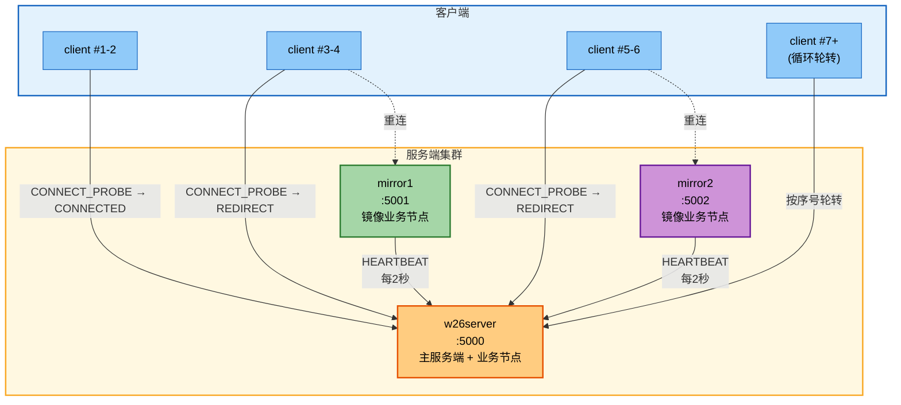
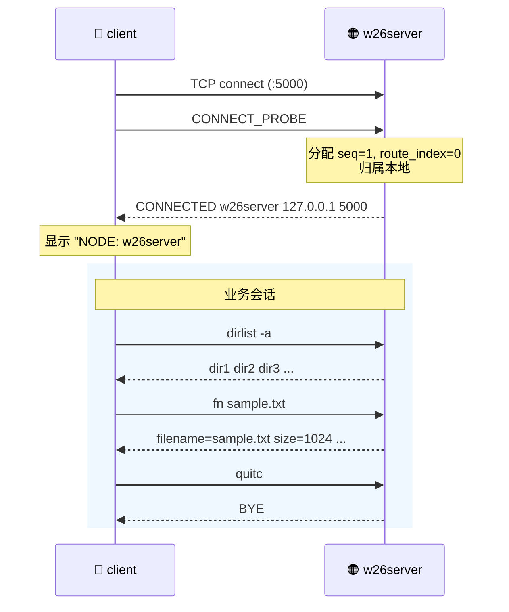
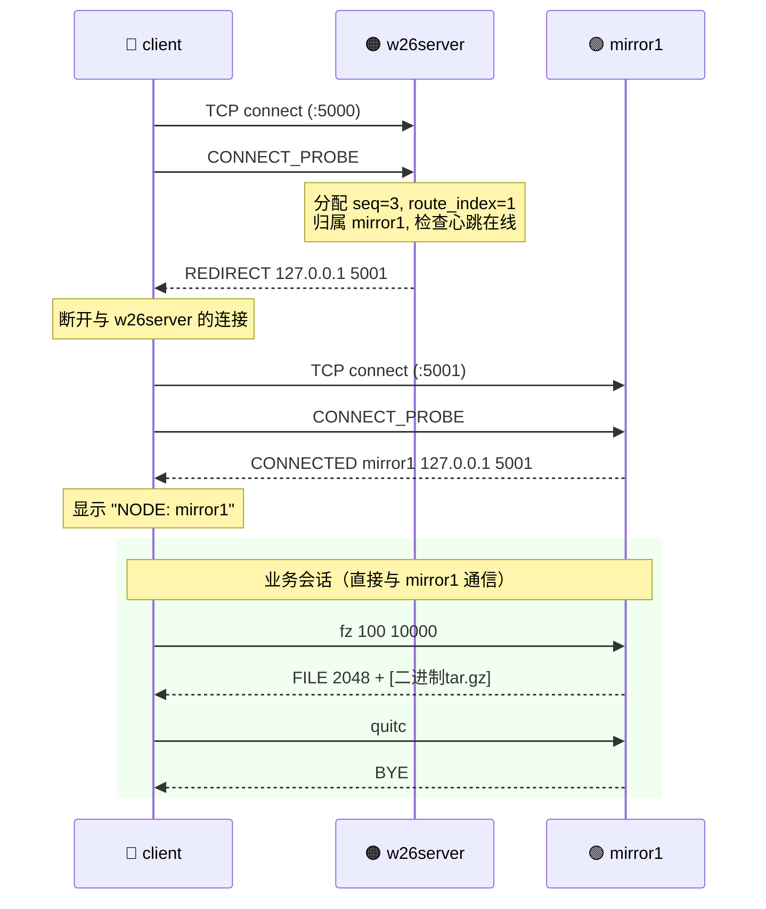
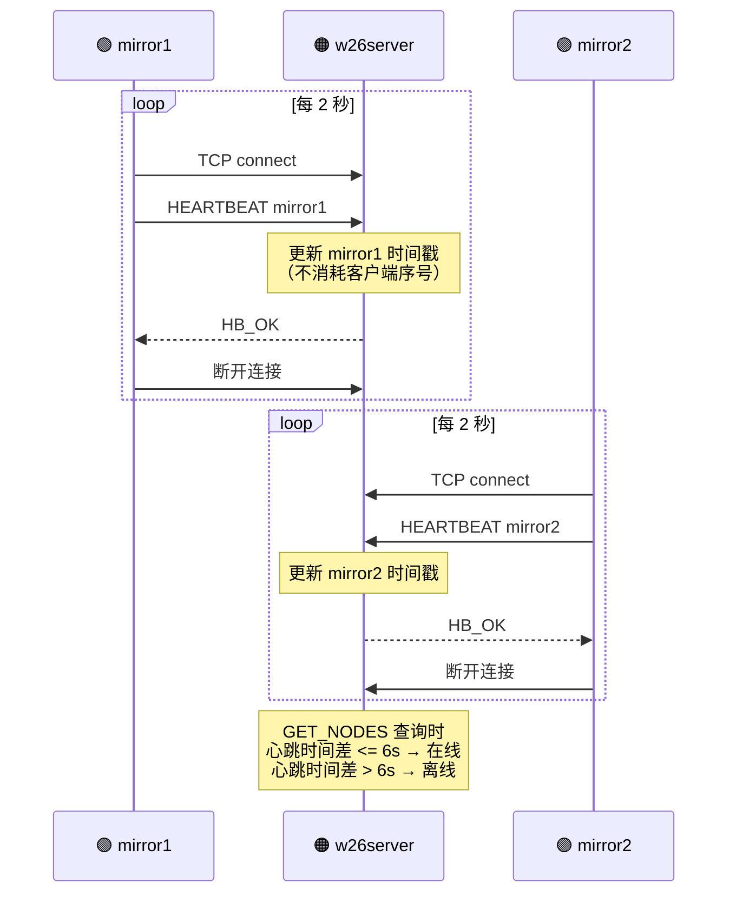
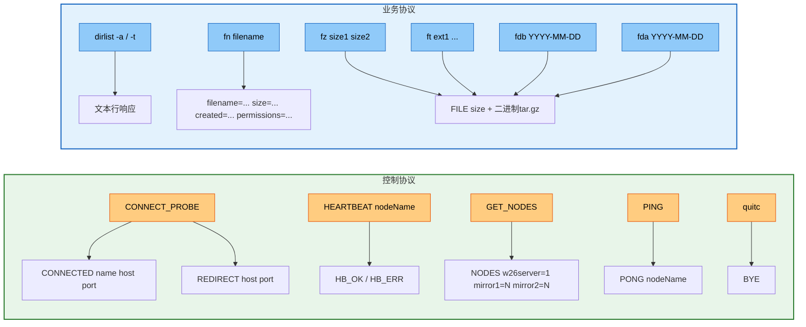
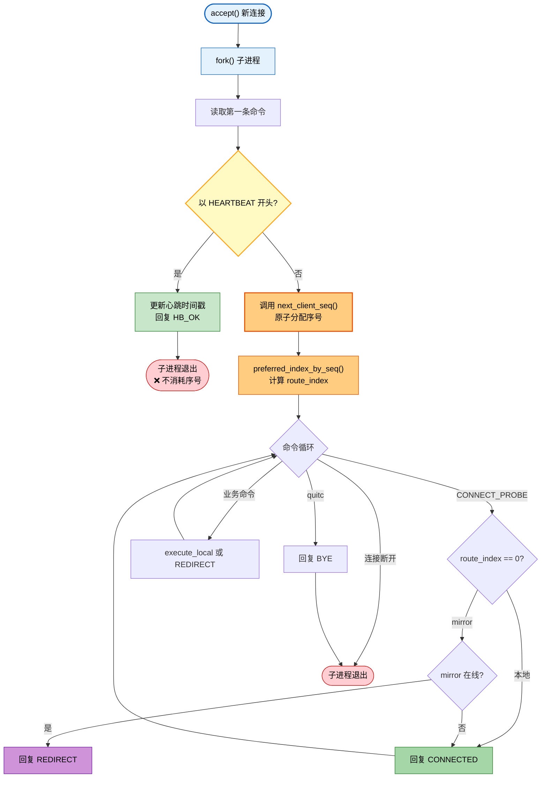

# ASP_Group — 分布式文件检索系统

## 1. 项目概述

基于 Socket 的分布式文件检索系统，采用 **1 主 + 2 镜像** 的三节点架构：

| 组件 | 端口 | 职责 |
|---|---|---|
| `w26server` | 5000 | 主服务端：接入入口、全局序号分配、自身序号段的业务处理 |
| `mirror1` | 5001 | 镜像节点 1：独立业务处理，通过心跳向主服上报在线状态 |
| `mirror2` | 5002 | 镜像节点 2：同 mirror1 |
| `client` | — | 客户端：连接主服获取路由，跟随 REDIRECT 到目标节点 |

三个服务节点都具备**完整且对等的业务处理能力**（dirlist / fn / fz / ft / fdb / fda），不依赖主服代理转发。

## 2. 系统架构



## 3. 连接序号分配规则

客户端连接序号由 `w26server` 通过原子文件计数器 (`/tmp/w26_client_seq.txt`) 分配，**心跳连接不消耗序号**。

| 序号 | 归属节点 | 说明 |
|---|---|---|
| 1-2 | w26server | 主服务端本地处理 |
| 3-4 | mirror1 | 重定向到 mirror1 |
| 5-6 | mirror2 | 重定向到 mirror2 |
| 7, 10, 13, 16... | w26server | 循环轮转 (seq-7) % 3 == 0 |
| 8, 11, 14, 17... | mirror1 | 循环轮转 (seq-7) % 3 == 1 |
| 9, 12, 15, 18... | mirror2 | 循环轮转 (seq-7) % 3 == 2 |

序号在 `w26server` 启动时清零，运行期间只增不减。


## 4. 客户端连接时序

### 4.1 归属 w26server（本地处理）



### 4.2 归属 mirror（REDIRECT 重连）



### 4.3 心跳上报



## 5. 通信协议



## 6. w26server 子进程处理流程

`w26server` 采用 `fork-per-connection` 并发模型。每个 TCP 连接由一个独立子进程处理，子进程通过读取第一条命令来区分心跳连接与客户端连接：



## 7. 项目结构

```text
ASP_Group/
├── src/
│   ├── w26server.c          # 主服务端（接入分流 + 业务处理）
│   ├── mirror1.c            # 镜像节点 1（心跳 + 业务处理）
│   ├── mirror2.c            # 镜像节点 2（心跳 + 业务处理）
│   └── client.c             # 客户端（CONNECT_PROBE + 命令交互）
├── scripts/
│   ├── start_all_servers.sh  # 一键启动三个服务端（支持 --root / --depth）
│   ├── stop_all_servers.sh   # 一键停止
│   ├── server_status.sh      # 查看运行状态
│   ├── run_w26server.sh      # 单独启动 w26server
│   ├── run_mirror1.sh        # 单独启动 mirror1
│   ├── run_mirror2.sh        # 单独启动 mirror2
│   └── run_client.sh         # 启动客户端
├── doc/
│   ├── Project_W26.pdf       # 项目需求文档
│   ├── Requirement_Summary.md
│   └── Requirement_Summary_zh.md
├── Makefile
├── .gitignore
├── logs/                     # 服务端日志输出
├── .pids/                    # 服务端 PID 文件
└── out/                      # 编译产物
```

## 8. 编译

```bash
make clean && make
```

编译产物输出到 `out/` 目录。

## 9. 运行

### 一键启动

```bash
./scripts/start_all_servers.sh --depth 6
```

可选参数：
- `--root <path>`：指定文件搜索根目录（覆盖 `W26_SEARCH_ROOT`）
- `--depth <1-64>`：限制递归扫描深度（覆盖 `W26_MAX_SCAN_DEPTH`）

### 启动客户端

```bash
./out/client
```

连接后自动显示归属节点：

```text
client connected to w26server (127.0.0.1:5001), NODE: mirror1
```

### 查看状态 / 停止

```bash
./scripts/server_status.sh       # 查看进程状态
./scripts/stop_all_servers.sh    # 停止所有服务端
```

## 10. 支持的命令

| 命令 | 说明 | 响应类型 |
|---|---|---|
| `dirlist -a` | 按名称排序列出子目录 | 文本行 |
| `dirlist -t` | 按时间排序列出子目录 | 文本行 |
| `fn <filename>` | 查找文件并返回元数据（名称/大小/时间/权限） | 文本行 |
| `fz <size1> <size2>` | 按文件大小范围筛选，打包回传 | `FILE <size>` + 二进制 |
| `ft <ext1> [ext2] [ext3]` | 按扩展名筛选，打包回传（最多 3 个） | `FILE <size>` + 二进制 |
| `fdb <YYYY-MM-DD>` | 筛选**早于**指定日期的文件，打包回传 | `FILE <size>` + 二进制 |
| `fda <YYYY-MM-DD>` | 筛选**晚于等于**指定日期的文件，打包回传 | `FILE <size>` + 二进制 |
| `quitc` | 断开连接 | `BYE` |

压缩包文件保存到客户端的 `~/project/temp.tar.gz`。

## 11. 环境变量

| 变量 | 默认值 | 说明 |
|---|---|---|
| `W26_SEARCH_ROOT` | `$HOME` | 文件搜索根目录 |
| `W26_MAX_SCAN_DEPTH` | `8` | 递归扫描最大深度（1-64） |

在大目录下执行文件检索时，建议限制搜索范围以避免耗时过长：

```bash
./scripts/start_all_servers.sh --root ~/workspace --depth 4
```

## 12. 关键实现细节

### 序号原子性

`w26server` 采用 `fork-per-connection` 模型，父进程的内存变量无法被子进程回写。因此客户端序号通过 `/tmp/w26_client_seq.txt` 文件持久化，使用 `fcntl` 文件锁保证跨子进程的原子递增。

### 心跳与序号隔离

mirror 节点每 2 秒向 w26server 发送一次 HEARTBEAT 短连接。`crequest()` 通过读取第一条命令来区分心跳和客户端——心跳连接处理后立即退出，**永远不会触发 `next_client_seq()`**，从而不干扰客户端的序号分配。

### 进程回收

主进程通过 `signal(SIGCHLD, SIG_IGN)` 忽略子进程退出信号，由内核自动回收僵尸进程，避免 `waitpid` 阻塞主循环。

### stale PID 自动清理

`start_all_servers.sh` 在启动前检测 `.pids/` 下的 PID 文件：如果对应进程仍在运行则报错，如果进程已死则自动清理残留 PID 文件后正常启动。
