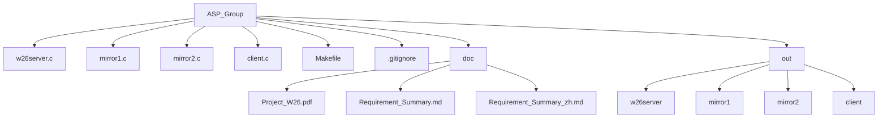
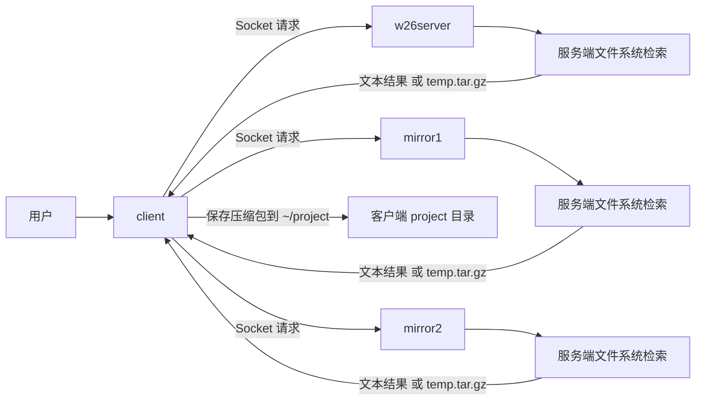

# ASP_Group Project README

## 1. 项目简介
本项目是一个基于 Socket 的客户端-服务端文件检索系统，包含 1 个主服务端和 2 个镜像服务端：

- w26server（主服务）
- mirror1（镜像服务 1）
- mirror2（镜像服务 2）
- client（客户端）

当前代码为作业提交版骨架，核心业务逻辑保留了 TODO 标注，便于后续逐步实现。

## 2. 项目结构图


## 3. 架构图


## 4. 编译脚本
当前 Makefile 会将编译产物统一输出到 out 目录。

```bash
#!/usr/bin/env bash
set -e

cd "$(dirname "$0")"
make clean
make
```

等效命令：

```bash
make clean && make
```

## 5. 运行脚本
建议使用 4 个终端分别运行 3 个服务端和 1 个客户端。

### 5.1 启动服务端
终端 1：

```bash
#!/usr/bin/env bash
set -e

cd "$(dirname "$0")"
./out/w26server
```

终端 2：

```bash
#!/usr/bin/env bash
set -e

cd "$(dirname "$0")"
./out/mirror1
```

终端 3：

```bash
#!/usr/bin/env bash
set -e

cd "$(dirname "$0")"
./out/mirror2
```

### 5.2 启动客户端
终端 4：

```bash
#!/usr/bin/env bash
set -e

cd "$(dirname "$0")"
./out/client
```

## 6. 常用测试命令示例
客户端启动后可输入：

```text
dirlist -a
dirlist -t
fn sample.txt
fz 100 10000
ft c txt
fdb 2026-01-01
fda 2026-03-31
quitc
```

## 7. 说明
- out 目录用于存放编译产物。
- .gitignore 已配置忽略 out 目录。
- 当前为骨架代码，未实现部分均以 TODO 标注。