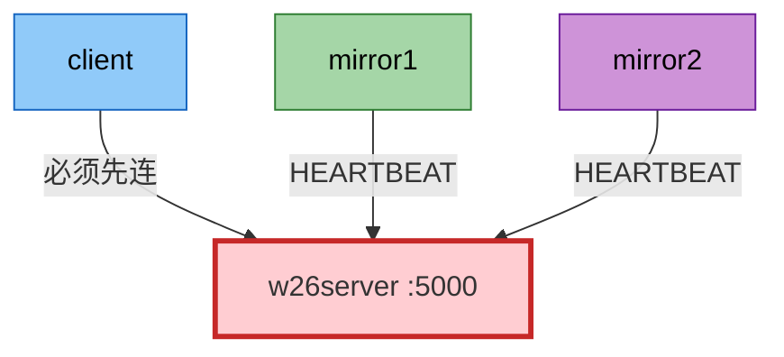
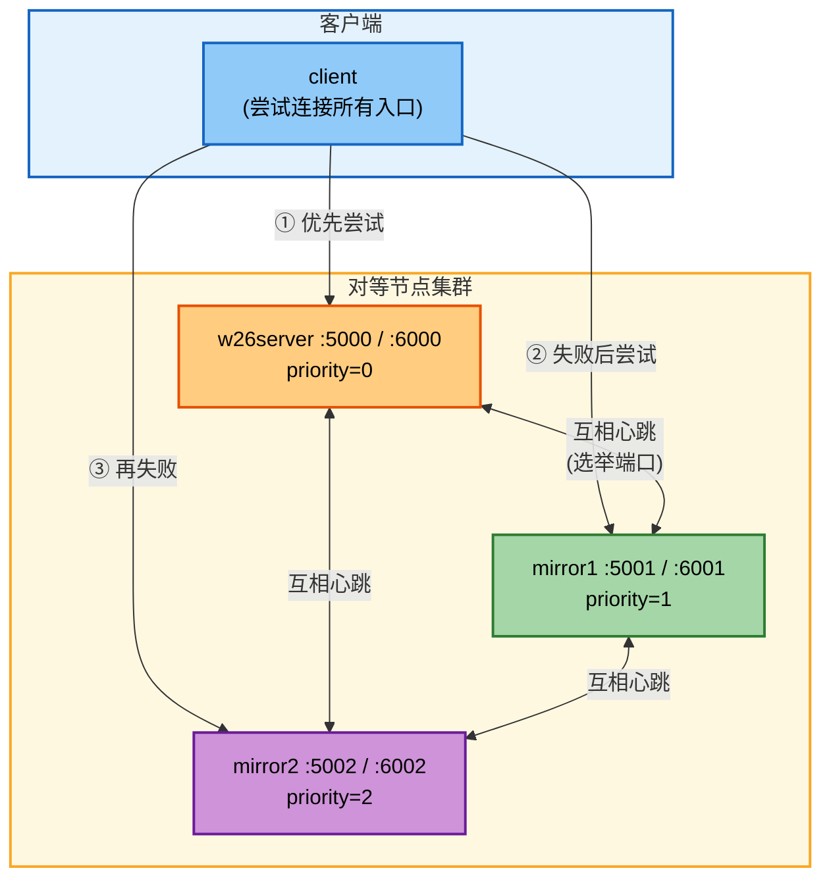
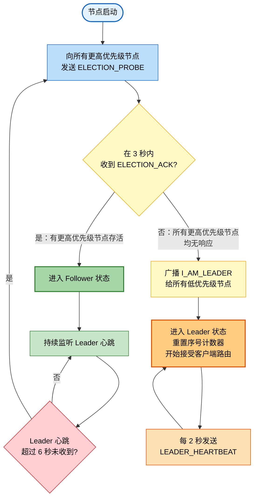
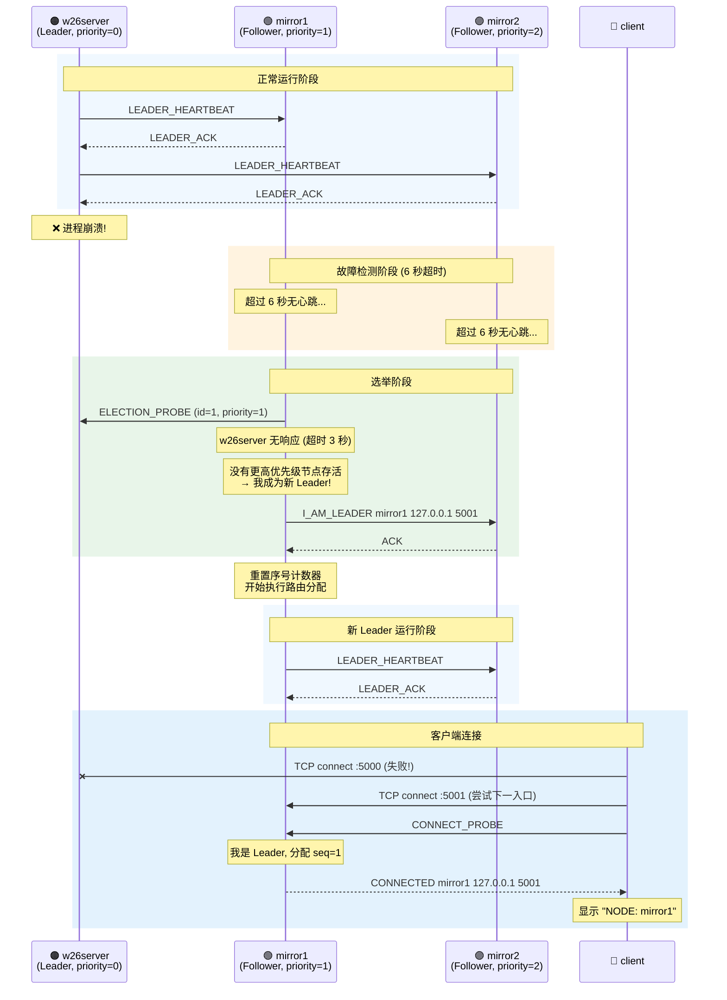
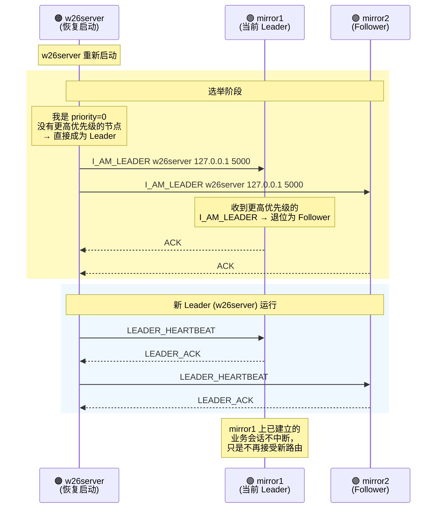

# 未来设计：Leader 选举与故障转移

> **状态**：设计方案（未实现）
>
> **目标**：消除 `w26server` 单点瓶颈，当主服务端不可用时，mirror 节点能自动接管 Leader 角色，保证系统持续服务。

---

## 1. 当前架构的单点问题

当前架构中，`w26server` 承担两个不可替代的职责：

1. **客户端入口**：所有 client 必须先连接 w26server 获取路由
2. **心跳接收方**：所有 mirror 的 HEARTBEAT 都发往 w26server

一旦 w26server 进程崩溃或机器宕机，整个系统不可用：



**故障影响**：w26server 崩溃 → client 连接失败 → mirror 心跳失败 → 系统停摆。

---

## 2. 设计目标

| 目标 | 说明 |
|---|---|
| 自动故障检测 | 节点通过互相心跳发现 Leader 离线 |
| 自动 Leader 选举 | 最高优先级的存活节点接管 Leader 角色 |
| 客户端透明切换 | client 尝试连接多个入口，自动找到当前 Leader |
| 旧 Leader 恢复后抢占 | 更高优先级节点恢复后自动重新成为 Leader |
| 已建立会话不中断 | Leader 切换只影响新连接的路由入口，不影响已绑定节点的业务会话 |

---

## 3. 总体架构

### 3.1 对等节点 + 静态优先级

所有节点升级为对等角色，每个节点都具备**完整业务处理 + 路由分配**能力。通过静态优先级决定 Leader：

```
w26server (priority=0, 最高) > mirror1 (priority=1) > mirror2 (priority=2, 最低)
```

### 3.2 改造后的架构图



每个节点新增一个**选举端口**（6000/6001/6002），用于节点间选举通信，与业务端口隔离。

---

## 4. 选举协议

### 4.1 新增协议消息

| 消息 | 方向 | 含义 |
|---|---|---|
| `ELECTION_PROBE <my_id> <my_priority>` | → 更高优先级节点 | "你还活着吗？" |
| `ELECTION_ACK <id>` | ← 被探测节点 | "我还活着，你别当 Leader" |
| `I_AM_LEADER <id> <host> <client_port>` | → 所有节点 | 广播自己成为 Leader |
| `LEADER_HEARTBEAT <leader_id>` | Leader → Followers | Leader 周期性存活通知 |
| `LEADER_ACK` | Follower → Leader | 心跳确认 |
| `NOT_LEADER <leader_host> <leader_port>` | Follower → Client | "我不是 Leader，Leader 在那边" |

### 4.2 选举规则

采用**Bully 算法**的简化版本：

1. 节点启动时，向所有**优先级比自己高**的节点发送 `ELECTION_PROBE`
2. 如果收到任何一个 `ELECTION_ACK` → 进入 Follower 状态，等待 `I_AM_LEADER` 广播
3. 如果超时（3 秒）未收到任何 `ELECTION_ACK` → 自己成为 Leader，广播 `I_AM_LEADER`
4. Leader 每 2 秒向所有 Follower 发送 `LEADER_HEARTBEAT`
5. Follower 超过 6 秒未收到 `LEADER_HEARTBEAT` → 重新触发选举



---

## 5. 节点状态机

### 5.1 状态定义

每个节点在运行时处于以下四种状态之一：

```
INIT → ELECTING → LEADER 或 FOLLOWER
                  ↑               │
                  └───────────────┘ (Leader 心跳超时 → 重新选举)
```

### 5.2 数据结构

```c
typedef enum {
    STATE_INIT,
    STATE_ELECTING,
    STATE_LEADER,
    STATE_FOLLOWER
} NodeState;

typedef struct {
    int       my_id;             // 本节点 id (0/1/2)
    int       my_priority;       // 本节点优先级 (数字越小越高)
    NodeState state;             // 当前状态
    int       leader_id;         // 当前已知 Leader (-1 表示未知)
    char      leader_host[64];   // Leader 的业务地址
    int       leader_client_port;// Leader 的业务端口
    time_t    last_leader_hb;    // 上次收到 Leader 心跳的时间
} ClusterState;
```

### 5.3 集群配置

```c
typedef struct {
    int    id;
    int    priority;
    char   host[64];
    int    client_port;    // 业务端口
    int    election_port;  // 选举端口
} NodeConfig;

static NodeConfig cluster[] = {
    { 0, 0, "127.0.0.1", 5000, 6000 },  // w26server
    { 1, 1, "127.0.0.1", 5001, 6001 },  // mirror1
    { 2, 2, "127.0.0.1", 5002, 6002 },  // mirror2
};

#define CLUSTER_SIZE 3
```

---

## 6. 故障转移时序

### 6.1 w26server 崩溃 → mirror1 接管



### 6.2 w26server 恢复 → 抢占式重新接管



---

## 7. 客户端改造

客户端需要从"只连接 w26server"改为"尝试连接集群中任意节点"：

```c
static const char *entry_points[] = {
    "127.0.0.1:5000",  // w26server（优先尝试）
    "127.0.0.1:5001",  // mirror1
    "127.0.0.1:5002",  // mirror2
};

int connect_to_cluster() {
    for (int i = 0; i < 3; i++) {
        int fd = try_connect(host, port, /*timeout_sec=*/2);
        if (fd < 0) continue;  // 连不上，尝试下一个

        send_msg(fd, "CONNECT_PROBE");
        char resp[256];
        recv_msg(fd, resp, sizeof(resp));

        if (strncmp(resp, "NOT_LEADER", 10) == 0) {
            // 该节点是 Follower，解析真正 Leader 的地址
            // 格式: NOT_LEADER <leader_host> <leader_port>
            close(fd);
            // 直接连接 Leader（可加入到队列头部）
            continue;
        }

        if (strncmp(resp, "REDIRECT", 8) == 0) {
            // 正常重定向逻辑（与当前实现一致）
            close(fd);
            // 解析目标地址并重连
            continue;
        }

        if (strncmp(resp, "CONNECTED", 9) == 0) {
            return fd;  // 成功
        }

        close(fd);
    }
    return -1;  // 所有节点均不可达
}
```

---

## 8. Leader 职责切换

当一个节点成为 Leader 时，需要额外承担以下职责：

```c
void become_leader(ClusterState *cs) {
    cs->state = STATE_LEADER;
    cs->leader_id = cs->my_id;

    // 1. 重置客户端序号文件
    unlink(CLIENT_SEQ_FILE);

    // 2. 启动 Leader 心跳子进程
    //    每 2 秒向所有 Follower 发送 LEADER_HEARTBEAT
    start_leader_heartbeat_thread(cs);

    // 3. 在 CONNECT_PROBE 处理中启用路由分配逻辑
    //    即当前 w26server crequest() 中的序号分配 + 路由判断
}

void become_follower(ClusterState *cs, int leader_id,
                     const char *leader_host, int leader_port) {
    cs->state = STATE_FOLLOWER;
    cs->leader_id = leader_id;
    strncpy(cs->leader_host, leader_host, sizeof(cs->leader_host));
    cs->leader_client_port = leader_port;
    cs->last_leader_hb = time(NULL);

    // 停止路由分配，只处理被路由到自己的业务会话
    // CONNECT_PROBE 收到时回复 NOT_LEADER
}
```

---

## 9. 选举核心伪代码

```c
void do_election(ClusterState *cs) {
    cs->state = STATE_ELECTING;
    bool higher_alive = false;

    for (int i = 0; i < CLUSTER_SIZE; i++) {
        if (cluster[i].priority >= cs->my_priority)
            continue;  // 只探测优先级比自己高的节点

        int fd = try_connect(cluster[i].host,
                             cluster[i].election_port,
                             /*timeout_sec=*/2);
        if (fd < 0) continue;  // 连不上，该节点可能已挂

        char msg[64];
        snprintf(msg, sizeof(msg), "ELECTION_PROBE %d %d",
                 cs->my_id, cs->my_priority);
        send(fd, msg, strlen(msg), 0);

        char resp[128];
        if (recv_with_timeout(fd, resp, sizeof(resp), /*sec=*/3) > 0
            && strncmp(resp, "ELECTION_ACK", 12) == 0) {
            higher_alive = true;
        }
        close(fd);
    }

    if (!higher_alive) {
        become_leader(cs);
        broadcast_i_am_leader(cs);
    } else {
        cs->state = STATE_FOLLOWER;
        // 等待 I_AM_LEADER 广播，超时 10 秒后重新选举
    }
}
```

---

## 10. 与 ZooKeeper 选举的对比

| 特性 | ZooKeeper (ZAB 协议) | 本方案 (Bully 简化) |
|---|---|---|
| 节点数 | 通常 3/5/7（奇数） | 固定 3 |
| 选举算法 | 基于 epoch + zxid 投票 | 静态优先级 + 超时探测 |
| 数据一致性 | 强一致（写 Leader，读任意） | 无需数据同步（各节点独立处理） |
| 脑裂防护 | Quorum（过半机制） | 优先级抢占 |
| 通信方式 | 长连接 + NIO | 短连接心跳 |
| 实现复杂度 | 极高 | 中等 |
| 适用场景 | 通用分布式协调 | 固定小规模集群 |

**不需要 Quorum 的原因**：三个节点不共享数据状态，不存在数据一致性问题。序号文件在 Leader 切换时重置，新 Leader 从 1 开始计数。

---

## 11. 脑裂防护策略

**场景**：网络分区导致两个节点互相认为对方已挂，各自选举成为 Leader。

**防护手段**：

| 策略 | 说明 |
|---|---|
| **优先级抢占** | 当分区恢复后，高优先级节点的 `I_AM_LEADER` 会让低优先级节点自动退位 |
| **序号重置** | 新 Leader 启动时重置序号文件，不会出现两个 Leader 分配重叠序号 |
| **客户端重连** | 客户端按优先级顺序尝试入口，分区恢复后自然回到高优先级 Leader |

> **局限**：在网络分区期间，两个"Leader"可能各自服务一部分客户端，序号空间独立。分区恢复后，新连接统一到真正的 Leader，但分区期间的序号不连续。对于本项目的文件检索场景，这是可接受的。

---

## 12. 实现计划

### 12.1 模块拆分

| 新增/修改 | 文件 | 说明 |
|---|---|---|
| **新增** | `src/election.h` | 选举数据结构、集群配置、API 声明 |
| **新增** | `src/election.c` | 选举状态机、心跳线程、`do_election()` 实现 |
| **修改** | `src/w26server.c` | 启动时调用 `do_election()`；Leader 执行路由分配，Follower 回复 `NOT_LEADER` |
| **修改** | `src/mirror1.c` | 同上，启动时参与选举 |
| **修改** | `src/mirror2.c` | 同上，启动时参与选举 |
| **修改** | `src/client.c` | 尝试连接多个入口，处理 `NOT_LEADER` 响应 |
| **修改** | `Makefile` | 编译 `election.c` 并链接 |

### 12.2 实施步骤

1. **Phase 1**：实现 `election.h/c`，包含状态机和选举协议
2. **Phase 2**：在三个服务端中集成选举逻辑，启动时参与选举
3. **Phase 3**：改造 `crequest()` 和 `process_command()`，Leader/Follower 分支处理
4. **Phase 4**：改造 client 的连接逻辑，支持多入口探测
5. **Phase 5**：测试场景
   - 正常启动 → w26server 成为 Leader
   - `kill w26server` → mirror1 自动接管
   - 重启 w26server → 抢占回 Leader
   - 网络分区模拟 → 分区恢复后状态收敛
